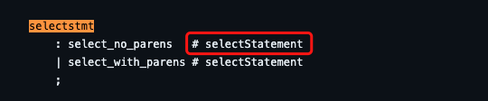

# dt-sql-parser-semantic-analyse-plugin

A [dt-sql-parser](https://github.com/DTStack/dt-sql-parser) plugin with semantic result. [Theory(zh-CN)](https://github.com/Kijin-Seija/dt-sql-parser-analyse-demo).

## Installation

```
npm install dt-sql-parser-semantic-analyse-plugin
```

## Quick Usage
```typescript
import { PostgreSQL } from 'dt-sql-parser'
import { PostgreSqlParser } from 'dt-sql-parser/dist/lib/postgresql/PostgreSqlParser'

const myPlugin = new DtSqlParserSemAnalysePlugin({
  parse: {
    sql: new PostgreSQL(),
    parser: PostgreSqlParser,
    alias: {
      selectstmt: 'selectStatement',
    },
    stmts: [
      'selectstmt',
    ],
    entities: [
      'target_el',
    ],
    rules: {
      select_target: [
        PostgreSqlParser.RULE_selectstmt,
        PostgreSqlParser.RULE_target_el,
      ]
    }
  }
})

const sql = 'SELECT a| FROM t'
const caretColumn = sql.indexOf('|') + 1
const result = myPlugin.parse(sql.replace('|', ''), { lineNumber: 1, columnNumber: caretColumn })
console.log(result)
```

This will use a postgresql Parser. You can get `select_target` text from parse result.

**Notice: A rule must start with a/an statement/entity and stop with an entity. You should add a node keywords(keyword is in your parser with format: `RULE_[keyword]`) into stmts/entities before using it.**

## Add a preprocessor

```typescript
const myPlugin = new DtSqlParserSemAnalysePlugin({
  preprocessor: [
    (sql) => sql.toUpperCase(),
    ...
  ],
  parse: {
    ...
  }
})
```

## Rule Chain Operator

You can set a negative number whose abs equals to a ruleIndex. That means exclude this rule.

Example:

```typescript
select_target_alias: [
  PostgreSqlParser.RULE_target_el,
  -PostgreSqlParser.RULE_attr_name,
  PostgreSqlParser.RULE_collabel
]
```

🚧 I will later work on `Operator.AND` and `Operator.OR`.

## Alias

Some node names in `dt-sql-parser`'s code are different from their antlr4's definition. You should declare them in `alias` params.

Example:

```typescript
const myPlugin = new DtSqlParserSemAnalysePlugin({
  parse: {
    ...
    alias: {
      selectstmt: 'selectStatement',
      target_el: 'target_label',
      table_name: 'tableName',
      ...
    }
    ...
  }
})
```

You can find possible alias in https://github.com/DTStack/dt-sql-parser/blob/main/src/grammar/postgresql/PostgreSqlParser.g4, then add it into `alias` option.



## Customize dt-sql-parser

If you want to use your custom `dt-sql-parser`, with external grammar(such as `DISTRIBUTED`, etc.), follow steps below:
1. fork [dt-sql-parser](https://github.com/DTStack/dt-sql-parser).
2. change its ANTLR4 file as whatever you want.
3. build and publish your `dt-sql-parser` npm package(`npm run antlr4 && npm publish`). Suppose to be `my-dt-sql-parser`.
4. use `my-dt-sql-parser` instead of `dt-sql-parser` to provide `parse.sql` and `parse.parser`.

Example:

```typescript
import { PostgreSQL } from 'my-dt-sql-parser'
import { PostgreSqlParser } from 'my-dt-sql-parser/dist/lib/postgresql/PostgreSqlParser'
const myPlugin = new DtSqlParserSemAnalysePlugin({
  parse: {
    sql: new PostgreSQL(),
    parser: PostgreSqlParser,
    ...
  }
})
```

